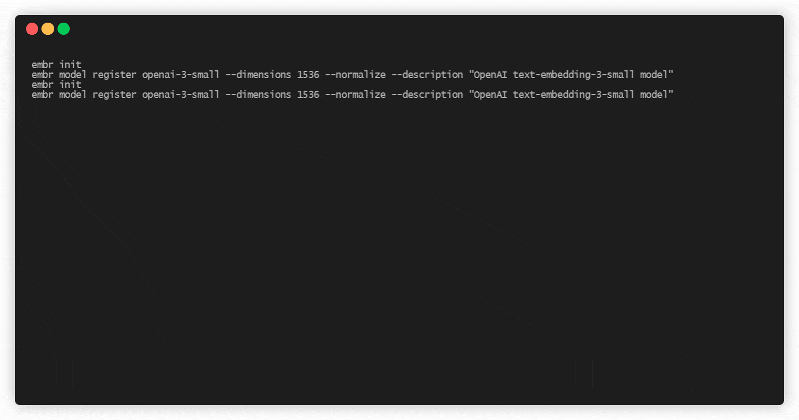

# Embedding Bridge

A command-line tool for managing and versioning embedding vectors. Think of it as "Git for Embeddings" - helping you track, compare, and manage semantic changes in your ML models.

## Demo



## Features

- Store and version control your embedding vectors
- Compare semantic similarity between embeddings
- Track embedding history and changes
- Roll back to previous embedding versions
- Support for multiple embedding models
- Organize embeddings into sets for better management

## Installation

```bash
make clean
make all
make install
```

### From release

```bash
# Download the release archive (tar.gz or zip):
#   tar -xzf embedding_bridge-<version>.tar.gz
#   # or
#   unzip embedding_bridge-<version>.zip
#   cd embedding_bridge-<version>

# Create a short-name `embr` launcher in this folder (symlink to the wrapper):
ln -s run_embedding_bridge.sh embr

# Add the release directory to your PATH so you can invoke the launcher:
export PATH="$PWD:$PATH"

# Now run the CLI (the wrapper will set LD_LIBRARY_PATH for you):
embr --help
```

## Quick Start

```bash
# Initialize
embr init

# Register a model
embr model register text-embedding-3-small --dimensions 1536 --normalize

# Store an embedding
embr store --embedding vector.bin --dims 1536 document.txt

# Check status
embr status document.txt

# Compare embeddings
embr diff <hash1> <hash2>

# Roll back to previous version
embr rollback <hash> document.txt

# Create and manage sets
embr set create experimental
embr switch experimental
```


## Core Commands

### Model Management
```bash
# Register a new model
embr model register <model-name> --dimensions <dims> [--normalize]

# List registered models
embr model list
```

### Embedding Operations
```bash
# Store embedding from binary file
embr store --embedding vector.bin --dims 1536 file.txt

# Store embedding from numpy file
embr store --embedding vector.npy file.txt

# Check embedding status
embr status file.txt
embr status -v file.txt  # verbose output

# Compare embeddings
embr diff <hash1> <hash2>

# Roll back to previous version
embr rollback <hash> file.txt

# View embedding log
embr log file.txt
```

### Set Management
```bash
# Create a new set of embeddings
embr set create <name>

# List available sets
embr set list
embr set list --verbose

# Switch between sets
embr switch <name>

# Show current set status
embr set status

# Compare differences between sets
embr set diff <set1> <set2>

# Delete a set
embr set -d <name> [--force]
```

### Merge Sets
```bash
# Merge embeddings from one set to another
embr merge <source-set> [<target-set>] [--strategy=<strategy>]
```

### Remote Operations
```bash
# Add a remote
embr remote add <name> <url>

# List remotes
embr remote list

# Push a set to remote
embr push <remote> [<set>]

# Pull a set from remote
embr pull <remote> [<set>]
```

### Other Useful Commands
```bash
# Download a file or directory from a repository
embr get <remote> <path>

# Garbage collect unreferenced embeddings
embr gc [options]
# Example: dry run
enbr gc -n

# Remove embeddings from tracking
embr rm file.txt
embr rm --cached file.txt
embr rm -m openai-3 file.txt
```

## Contributing

We welcome contributions! Please see our [Contributing Guidelines](CONTRIBUTING.md) for details.

## License

This project is licensed under the GNU General Public License v2.0 - see the [LICENSE](LICENSE) file for details. 
